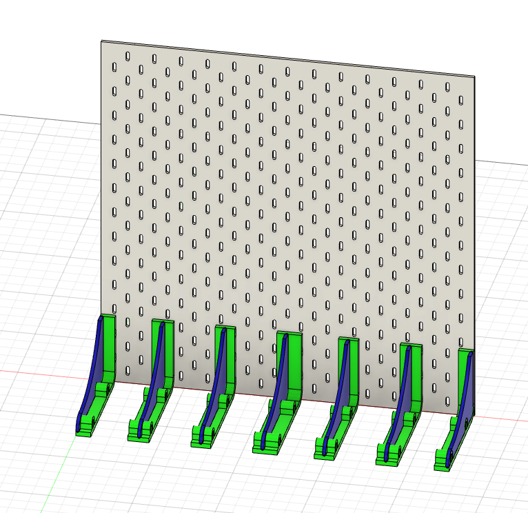

# Wisp3D 

## Project aim
The aim of the project is to make a system like Thingiverse customizer for CadQuery scripts.
As of now only a small part of work is done for that.

## Current state
Currently there is only a script to make customizable spool holders for pegboards like IKEA SKADIS.



## How to use
1. Install [conda](https://docs.conda.io/projects/conda/en/latest/user-guide/install/index.html).
2. Setup conda environment
    ```
    conda env create -f .\environment.yml 
    ```
3. Activate the environment
    ```
    conda activate wisp3d
    ```
4. Run the script
    ```
    python -m wisp3d.main
    ```

    That command will make `pegboard.step` that you can open with your favourite CAD and then export individual bodies for 3D printing.
    Change values in `config.yml` for your needs.


